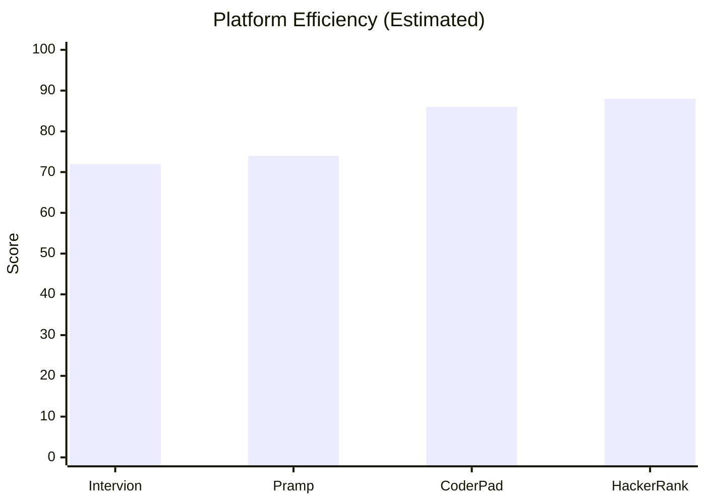
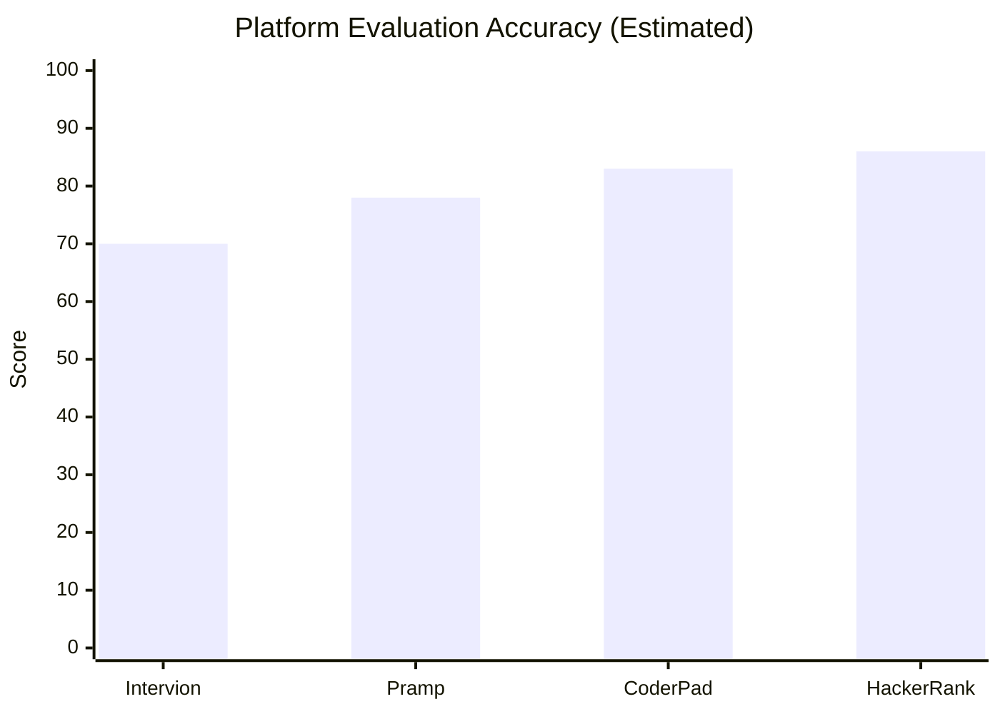
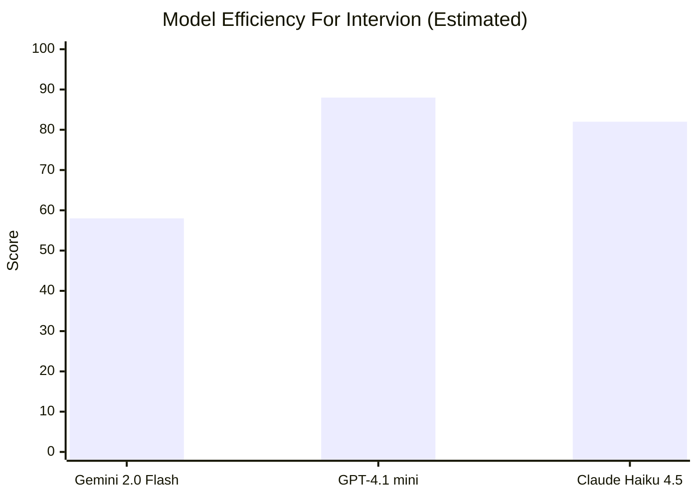
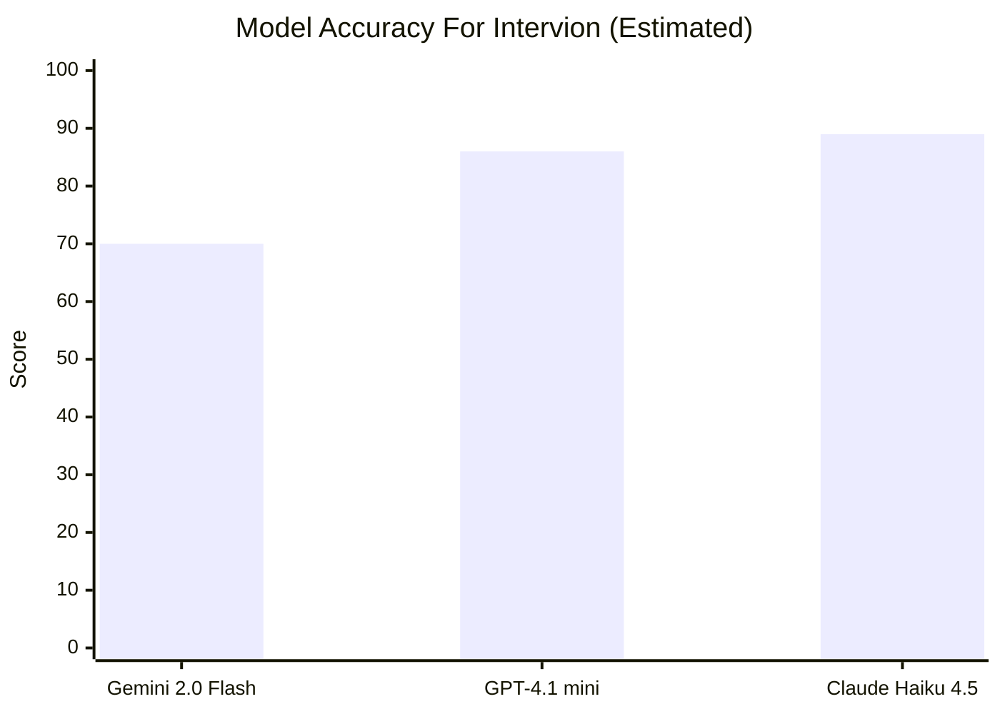
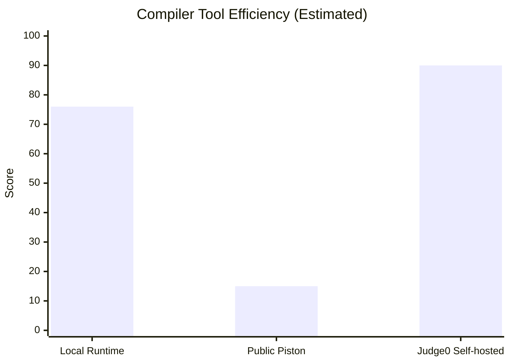

# Intervion Comparison Study

## Scope

This study compares **Intervion** with established interview and coding platforms in the same general category:

- **Pramp**
- **CoderPad**
- **HackerRank Interview**

It also compares **AI model choices**, **compiler/runtime tools**, and the **current technology stack** used in this repository.

## Method

This document uses two types of inputs:

- **Source-backed feature comparison** from official product and model pages
- **Engineering assessment scores** for efficiency and accuracy, normalized to `0-100`

Important:

- The **graphs are comparative engineering estimates**, not lab benchmarks.
- "Efficiency" here means **workflow speed, operational fit, and implementation practicality**.
- "Accuracy" here means **how reliably the platform/model/tool supports realistic candidate evaluation and correct results**.

## Project Positioning

Intervion is strongest as an **all-in-one academic and interview-prep platform**:

- Resume upload and formatting
- AI interview practice
- Job application workflow
- Study rooms
- Collaborative whiteboard
- Collaborative coding workspace

Compared with mature external platforms, Intervion is broader in student workflow coverage, but still lighter in:

- interview process hardening
- anti-cheat controls
- sandboxed code execution maturity
- production-grade AI fallback strategy
- scoring standardization

## Platform Comparison

| Platform | Core Strength | Collaboration | Coding Interview Depth | AI/Automation | Standardized Hiring Workflow | Best Fit |
| --- | --- | --- | --- | --- | --- | --- |
| **Intervion** | Integrated student workflow | Strong for rooms, whiteboard, chat, shared coding | Moderate | Moderate, but current provider reliability is weak | Moderate | campus placements, interview prep, internal academic workflow |
| **Pramp** | Peer mock interview practice | Strong 1-on-1 live practice | Moderate | Low | Low | peer-driven interview practice |
| **CoderPad** | Real-time technical interview IDE | Strong collaborative IDE | Strong | Moderate | Moderate | technical interviews and realistic live coding |
| **HackerRank Interview** | Structured hiring workflow | Strong collaborative IDE | Very strong | Strong | Strong | standardized technical hiring at scale |

### Source-backed observations

- **Pramp** emphasizes peer matching, full interview questions, and real-time collaborative interview practice with video chat.
- **CoderPad** emphasizes a VS Code-like interview environment, replay/review, and real-time coding workflow.
- **HackerRank Interview** emphasizes collaborative live coding, templates, scorecards, anti-cheat signals, and AI-aware interview workflows.

## Platform Efficiency And Accuracy

These scores are estimated for the **current Intervion codebase after the room editor upgrade**, compared with mature external platforms.

### Interpretation

- **Efficiency**: how quickly and reliably teams can run the workflow
- **Accuracy**: how well the platform reflects real candidate skill in practice

### Why these scores

- **Intervion**
  - Strong integrated flow and good collaboration coverage
  - Lower score because AI reliability is unstable, code execution is not yet sandboxed, and there is no anti-cheat or replay-grade interview telemetry
- **Pramp**
  - Good realism because humans interview each other
  - Lower operational efficiency because it is less automated and less structured for end-to-end hiring
- **CoderPad**
  - High efficiency due to realistic IDE workflow and low-friction technical interview setup
  - High evaluation accuracy because it closely mirrors developer environments
- **HackerRank Interview**
  - Highest process maturity in this comparison due to templates, scorecards, collaborative coding, and integrity controls

## Model Comparison For Intervion

The current codebase uses **Gemini 2.0 Flash** for interview and question generation. That is now a poor production choice for this project because:

- it is listed as **deprecated** on the Gemini models page
- your current key is returning **quota exhausted**

### Model comparison for this use case

| Model | Current Fit For Intervion | Efficiency | Accuracy | Notes |
| --- | --- | ---: | ---: | --- |
| **Gemini 2.0 Flash** | Weak | 58 | 70 | fast historically, but deprecated and currently failing in this project |
| **GPT-4.1 mini** | Strong default choice | 88 | 86 | good price/performance, strong instruction following, tool calling, long context |
| **Claude Haiku 4.5** | Strong premium-fast choice | 82 | 89 | very fast, near-frontier small-model quality, but more expensive |

### Model recommendation

- **Best balanced default**: `GPT-4.1 mini`
- **Best fast premium fallback**: `Claude Haiku 4.5`
- **Do not keep Gemini 2.0 Flash as the only provider**

### Suggested provider strategy

1. Use `GPT-4.1 mini` as the default for:
   - interview question generation
   - follow-up interview turns
   - resume structuring
   - coding question generation
2. Add a second provider fallback:
   - `Claude Haiku 4.5`
3. Keep a non-LLM fallback path:
   - local/sample coding questions
   - rule-based resume formatting fallback

## Tool Comparison

### Code execution tool choices

| Tool | Current Status | Efficiency | Accuracy | Risk | Recommendation |
| --- | --- | ---: | ---: | --- | --- |
| **Local runtime execution** | Now active in Intervion | 76 | 72 | low isolation, fewer languages, server security risk | acceptable dev fallback only |
| **Public Piston API** | Broken for this project | 15 | 40 | whitelist-only as of Feb 15, 2026 | avoid |
| **Judge0 self-hosted** | Not integrated yet | 90 | 88 | infra overhead | best production compiler choice |

### Why Judge0 is a better long-term fit

- sandboxed execution
- support for 60+ languages
- detailed execution results
- scalable API-first design
- specifically positioned for coding platforms, recruitment platforms, and AI-agent code execution

## Technology Comparison

### Current Intervion stack

| Layer | Current Choice | Assessment |
| --- | --- | --- |
| Frontend | React + Vite + TypeScript | good for fast UI iteration |
| UI system | Tailwind + shadcn-style components | good developer velocity |
| Realtime | Socket.IO | good MVP collaboration layer |
| Editor | Monaco Editor | strong fit for coding interviews |
| Backend | Express + Node.js | good for rapid full-stack iteration |
| Database | MongoDB + Mongoose | good for rooms, users, applications |
| File handling | Firebase storage setup | acceptable for resumes/assets |
| AI | Gemini-only in codebase today | weak due provider fragility |
| Code execution | local runtime fallback | acceptable short-term, weak long-term |

### Comparison with stronger production-oriented choices

| Concern | Current Intervion Choice | Stronger Alternative | Comment |
| --- | --- | --- | --- |
| AI generation | Gemini-only | multi-provider abstraction | biggest reliability gap |
| Collaborative code sync | Socket.IO event sync | CRDT layer like Yjs/Liveblocks + awareness | better for concurrent editing conflicts |
| Code execution | local runtimes | Judge0 self-hosted or isolated container workers | much safer and more scalable |
| Interview auditability | minimal | playback, session events, rubric storage | needed for enterprise-grade evaluation |
| Scoring | ad hoc | structured rubric engine + reviewer calibration | needed for hiring confidence |

## Strengths Of Intervion

- Broad feature coverage in one codebase
- Strong student-centric workflow
- Good foundation for collaborative study and interview practice
- Flexible Node/React stack
- Monaco and Socket.IO are appropriate starting choices

## Weaknesses Of Intervion

- AI provider dependency is fragile
- Current whiteboard/type issues still block clean build
- Compiler is functional now, but not production-safe yet
- Limited interview analytics and scoring rigor
- No enterprise anti-cheat or candidate integrity controls

## Recommended Roadmap

### Phase 1

- Replace Gemini-only usage with provider abstraction
- Add `GPT-4.1 mini` as primary model
- Keep sample/local fallbacks for all AI flows
- Fix current TypeScript build blockers

### Phase 2

- Replace local execution with **Judge0 self-hosted** or isolated execution workers
- Add execution time/memory limits
- Add per-language support matrix in UI

### Phase 3

- Add scoring rubrics and structured feedback storage
- Add interview playback/session telemetry
- Add better shared editing conflict handling

### Phase 4

- Add enterprise-style interview integrity features
- Add analytics dashboards for question quality, interview quality, and placement outcomes

## Bottom Line

Intervion is already differentiated by combining:

- interview prep
- job workflow
- study rooms
- collaborative coding
- whiteboard collaboration

Its best next step is **not adding more features first**. The best next step is improving **reliability and evaluation quality**:

- better model provider strategy
- safer execution infrastructure
- stronger scoring and review workflow

If that is done well, Intervion can sit between **Pramp-style peer practice** and **HackerRank/CoderPad-style structured technical evaluation**.

## Sources

- [Pramp official site](https://www.pramp.com/)
- [CoderPad coding interviews](https://coderpad.io/platform/coding-interviews/)
- [HackerRank Interview](https://www.hackerrank.com/products/interview)
- [Google Gemini models page](https://ai.google.dev/gemini-api/docs/models)
- [OpenAI GPT-4.1 mini model docs](https://developers.openai.com/api/docs/models/gpt-4.1-mini)
- [Anthropic models overview](https://platform.claude.com/docs/en/about-claude/models/overview)
- [Judge0 official site](https://judge0.com/)
- [Monaco Editor API docs](https://microsoft.github.io/monaco-editor/typedoc/index.html)
